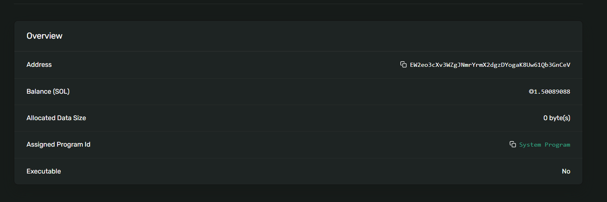

# Lamport Locker

A Solana program built with Anchor that allows users to create vault accounts, deposit and withdraw SOL, and close vaults to recover all funds including rent-exempt amounts.

## Features

- **Initialize**: Create a new vault account with associated state
- **Deposit**: Transfer SOL into your vault
- **Withdraw**: Withdraw SOL from your vault (with rent exemption checks)
- **Close**: Close vault and recover all SOL including rent

## Live Demo (Devnet)

### Vault Account with SOL



### Example Transactions

**Initialize Transaction:**
[3ZBgjTP8SDxDQvPbRRwxLjCHDDRL3VnCLDfaSMnXdBfWo3RUnKcc25mhHVVRBqsLr8YWdKvDgc6C7gCEpL86V9W8](https://explorer.solana.com/tx/3ZBgjTP8SDxDQvPbRRwxLjCHDDRL3VnCLDfaSMnXdBfWo3RUnKcc25mhHVVRBqsLr8YWdKvDgc6C7gCEpL86V9W8?cluster=devnet)

**Deposit Transaction:**
[2Uysq81eAUJdez3gc1pEt13AEcdoWNiLcnQiL561edj4b9M7rK6utjivRzvcysTD2Y8kXi3jLpPARjF5DtEFc93v](https://explorer.solana.com/tx/2Uysq81eAUJdez3gc1pEt13AEcdoWNiLcnQiL561edj4b9M7rK6utjivRzvcysTD2Y8kXi3jLpPARjF5DtEFc93v?cluster=devnet)

**Withdraw Transaction:**
[ZajkDXCvdoo7EUBc3E7kFgYVxZ9bPN3S8BR4WvGJwF5yokaSXjYWFRUGPkwaeinW7LbULmdwdo1FNt2LyWzWjsR](https://explorer.solana.com/tx/ZajkDXCvdoo7EUBc3E7kFgYVxZ9bPN3S8BR4WvGJwF5yokaSXjYWFRUGPkwaeinW7LbULmdwdo1FNt2LyWzWjsR?cluster=devnet)

**Close Transaction:**
[5j5arsagshrARdybDNUhSdKthUbJk7ySLC3fnwSVGFD7iLqMot6cbZvssPGwWUSxtmY5FGCWv9KLufTpuxsTmYmz](https://explorer.solana.com/tx/5j5arsagshrARdybDNUhSdKthUbJk7ySLC3fnwSVGFD7iLqMot6cbZvssPGwWUSxtmY5FGCWv9KLufTpuxsTmYmz?cluster=devnet)

### Account Addresses

**Vault Account:**
[EW2eo3cXv3WZgJNmrYrmX2dgzDYogaK8Uw61Qb3GnCeV](https://explorer.solana.com/address/EW2eo3cXv3WZgJNmrYrmX2dgzDYogaK8Uw61Qb3GnCeV?cluster=devnet)

**Vault State Account:**
[Gismt6GQgghx8smALtBReFGJ2PN35j6pa24zGXWWzTjq](https://explorer.solana.com/address/Gismt6GQgghx8smALtBReFGJ2PN35j6pa24zGXWWzTjq?cluster=devnet)

## Instructions

### Initialize

Creates a new vault PDA and vault state account for the user.

```rust
pub fn initialize(ctx: Context<Initialize>) -> Result<()>
```

### Deposit

Deposits SOL from user's account into the vault.

```rust
pub fn deposit(ctx: Context<Vault>, amount: u64) -> Result<()>
```

### Withdraw

Withdraws SOL from vault back to user. Includes checks for:
- Sufficient funds in vault
- Maintaining minimum balance for rent exemption

```rust
pub fn withdraw(ctx: Context<Vault>, amount: u64) -> Result<()>
```

### Close

Closes the vault account and transfers all remaining SOL (including rent) back to the user.

```rust
pub fn close(ctx: Context<Close>) -> Result<()>
```

## Setup

### Prerequisites

- [Anchor](https://www.anchor-lang.com/) installed
- [Solana CLI](https://docs.solana.com/cli/install-solana-cli-tools) installed
- Node.js and npm/yarn

### Installation

```bash
# Install dependencies
npm install
# or
yarn install

# Build the program
anchor build

# Run tests
anchor test
```

## Error Codes

- `InsufficientFunds`: Attempted to withdraw more than available in vault
- `MinimumBalanceRequired`: Withdrawal would leave vault below rent-exempt minimum

## Testing

The test suite covers:
- Vault initialization
- Depositing SOL
- Withdrawing SOL
- Error handling for insufficient funds
- Error handling for minimum balance requirement
- Closing vault and recovering funds

Run tests with:
```bash
anchor test
```

## Program ID

[Fsqxbxgpm1rP2gWoXxmm5otdJmjCBE2GG39G1TaL9u4K](https://explorer.solana.com/address/Fsqxbxgpm1rP2gWoXxmm5otdJmjCBE2GG39G1TaL9u4K?cluster=devnet)
